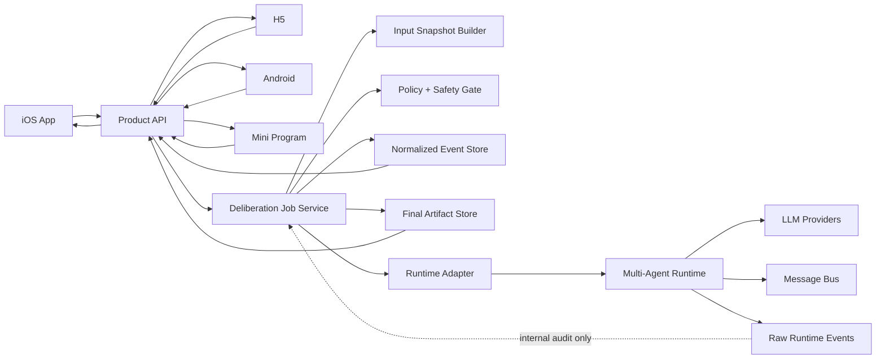

# Multi-Agent Deliberation Service Pattern

Date: 2026-06-17
Status: accepted reference architecture

## 一句话结论

把“多 Agent 讨论给结果”沉淀成一个独立的服务端模式：

```text
Client
-> Product API
-> Deliberation Job
-> Runtime Adapter
-> Multi-Agent Runtime
-> Normalized Events + Final Artifact
-> Client renders process and result
```

客户端可以是 iOS、H5、Android、小程序或后台管理端，但它们都不直接理解 AgentScope、CrewAI、Claude Code、Qoder 这类 runtime 的内部资源。客户端只消费产品稳定的 `job / event / artifact` 契约。

## 适用场景

适合这些产品形态：

- 情绪倾诉后的专家团建议。
- 职业规划、学习规划、投资前研究、复杂决策复盘。
- 多角色评审，例如产品、技术、法务、财务一起给建议。
- 需要展示“过程”的 AI 报告，而不只是一次模型回答。
- 用户可以离开页面，稍后回来查看过程和最终结论。

不适合这些场景：

- 一次简单摘要。
- 强实时聊天。
- 低价值、低风险、无需过程的问答。
- 输出必须严格确定、不能容忍模型波动的交易或控制系统。

## 核心原则

- 产品资源模型优先于 runtime 资源模型。
- 过程是交付物，不只是 debug log。
- 多端只看稳定 API，不复制业务逻辑。
- Runtime 可以替换，`DeliberationJob`、事件契约和最终 artifact 不能随意变。
- Agent 输出必须增强用户判断，不替用户做不可解释的决定。
- 成本、轮次、超时、失败和安全边界必须由产品层控制。

## Reference Architecture



## 服务端分层

### 1. Product API

面向所有客户端，负责：

- 鉴权和空间权限。
- 创建、查询、取消、重试 job。
- 暴露标准事件流和最终 artifact。
- 屏蔽 runtime 内部 session、team、worker、message bus。

### 2. Deliberation Job Service

这是核心业务层，负责：

- 冻结输入快照。
- 选择流程模板。
- 记录状态机。
- 控制轮次、超时、成本、重试。
- 把 runtime raw event 转成产品事件。
- 保存最终 artifact。

### 3. Runtime Adapter

隔离具体多 Agent runtime。

首选 adapter：

```text
AgentScopeAdapter
```

保留 fallback：

```text
LightweightStateMachineAdapter
CrewAIFlowAdapter
```

不建议直接作为生产 runtime：

```text
ClaudeCodeCliAdapter
QoderCliAdapter
```

它们更适合内部研发、prompt 评测、代码实现和离线审查。

### 4. Multi-Agent Runtime

负责具体执行：

- 创建 leader/judge。
- 创建 worker experts。
- worker 独立 session。
- 多轮 message 交换。
- 事件流输出。
- 最终裁判收敛。

Runtime 不拥有产品最终语义。它只执行任务。

## 资源模型

建议抽象成通用 `deliberation_*` 资源，不绑定 Emotion Talk。

```text
deliberation_jobs
deliberation_participants
deliberation_rounds
deliberation_messages
deliberation_events
deliberation_artifacts
deliberation_raw_runtime_events
model_runs
```

Emotion Talk 可以映射为：

| 通用资源 | Emotion Talk |
|---|---|
| `source_type` | `recording` |
| `source_id` | `recording_session_id` |
| `space_id` | 倾诉空间 |
| `input_snapshot` | transcript + summary + profile + selected history |
| `deliberation_artifact` | 专家团建议 |

其他项目可以映射为：

| 通用资源 | 例子 |
|---|---|
| `source_type=decision` | 创业方向决策 |
| `source_type=document` | 合同评审 |
| `source_type=case` | 学习规划、职业规划 |
| `source_type=meeting` | 会议后多角色复盘 |

## Job 状态机

```text
created
-> input_frozen
-> safety_prechecked
-> running
-> synthesizing
-> safety_reviewing
-> completed
```

失败或人工动作：

```text
created/running -> cancelled
running/synthesizing -> failed
failed -> retrying -> running
completed -> regenerating -> running
```

状态机由产品层维护，不依赖 runtime 自己的状态命名。

## API Contract

通用 API 形态：

```http
POST   /deliberation-jobs
GET    /deliberation-jobs/{jobId}
GET    /deliberation-jobs/{jobId}/events
GET    /deliberation-jobs/{jobId}/artifact
POST   /deliberation-jobs/{jobId}/cancel
POST   /deliberation-jobs/{jobId}/retry
POST   /deliberation-jobs/{jobId}/regenerate
```

创建 job 的请求应包含：

```json
{
  "sourceType": "recording",
  "sourceId": "rec_123",
  "template": "emotion_talk_expert_team_v1",
  "scope": {
    "primary": "current_recording",
    "includeHistory": true,
    "includeProfile": true
  },
  "clientRequestId": "idempotency-key"
}
```

客户端不传模型名、不传 runtime 名、不传专家 prompt。

## Event Contract

客户端只消费 normalized events。

推荐事件类型：

```text
job_created
input_snapshot_frozen
safety_precheck_passed
safety_precheck_blocked
round_started
expert_message_added
expert_challenge_added
expert_revision_added
judge_synthesis_started
judge_synthesis_delta
safety_review_started
safety_review_passed
artifact_completed
job_completed
job_failed
job_cancelled
runtime_limit_hit
```

事件结构：

```json
{
  "eventId": "evt_123",
  "jobId": "job_123",
  "seq": 42,
  "type": "expert_message_added",
  "round": 1,
  "participant": "life_coach",
  "visibility": "user_visible",
  "payload": {
    "title": "初判",
    "content": "..."
  },
  "createdAt": "2026-06-17T10:00:00+08:00"
}
```

`seq` 必须单调递增，便于多端重连和回放。

## Raw Runtime Event Mapping

AgentScope 已验证可输出这些关键事件：

```text
REPLY_START
MODEL_CALL_START
TEXT_BLOCK_DELTA
TOOL_CALL_START
TOOL_RESULT_START
HINT_BLOCK
EXCEED_MAX_ITERS
REPLY_END
```

推荐映射：

| Raw AgentScope event | Product event |
|---|---|
| `REPLY_START` | `round_started` 或 `judge_synthesis_started` |
| `HINT_BLOCK` | `expert_message_added` / `expert_challenge_added` |
| `TEXT_BLOCK_DELTA` | `judge_synthesis_delta`，仅对最终裁判可见 |
| `TOOL_CALL_*` | 默认 internal，不直接给用户 |
| `TOOL_RESULT_*` | 默认 internal，必要时聚合成过程节点 |
| `EXCEED_MAX_ITERS` | `runtime_limit_hit`，随后由产品层决定失败或强制收敛 |
| `REPLY_END` | 当前 reply 完成，可触发 idle timeout 判断 |

原则：

- raw events 全量内部保存，方便审计和 debug。
- user visible events 必须干净、克制、可读。
- 不把底层工具调用噪音暴露给用户。

## 标准执行流程

```text
1. Client 创建 job
2. Product API 校验权限
3. Job Service 冻结输入快照
4. Safety precheck
5. Runtime Adapter 创建 runtime session/team
6. Round 1: experts 初判
7. Round 2: experts 互相质疑
8. Round 3: experts 修正观点
9. Judge 汇总过程和结论
10. Safety review
11. Artifact 落库
12. Client 通过 events + artifact 展示
```

V1 可固定 3 个专家和 3 轮流程。不要一开始让用户自由选择专家。

## Artifact Contract

最终 artifact 建议结构：

```json
{
  "overview": "...",
  "processSummary": [
    {
      "round": 1,
      "title": "初判",
      "summary": "..."
    }
  ],
  "suggestions": [
    {
      "title": "...",
      "body": "...",
      "confidence": "medium",
      "evidence": ["..."]
    }
  ],
  "keyUncertainties": ["..."],
  "safetyBoundary": "...",
  "generatedAt": "2026-06-17T10:00:00+08:00",
  "modelTrace": {
    "runtime": "agentscope",
    "templateVersion": "emotion_talk_expert_team_v1"
  }
}
```

对情绪、心理、自我认知相关产品：

- 不输出诊断。
- 不承诺治疗。
- 不替用户做重大人生决定。
- 建议要少，最好 1 到 3 条。
- 保留不确定性和求助边界。

## 多端展示策略

### iOS

- 优先展示 `job.status`、当前轮次和最终 artifact。
- 可用 SSE、WebSocket 或轮询，取决于网络和后台限制。
- 用户离开页面后，回来通过 `GET /events?afterSeq=` 恢复。

### H5

- SSE 最自然。
- 适合展示逐步生成过程。
- 也可以只展示 completed artifact。

### Android

- 与 iOS 相同，依赖 normalized event contract。

### 小程序

- 长连接能力受平台约束时，用短轮询。
- 仍然依赖 `seq` 回放，不为小程序单独复制业务逻辑。

## 部署形态

推荐先用普通 Docker 部署：

```text
product-api
deliberation-worker
agentscope-runtime
redis
postgres/mysql
object-storage
```

作者熟悉服务器和 Docker，因此 Redis、MySQL/PostgreSQL、Docker Compose 不是主要成本。真正要控制的是：

- 多租户隔离。
- 运行时成本。
- 长任务取消和超时。
- 事件回放一致性。
- prompt 和模型版本追踪。
- 安全输出边界。

## 技术选型结论

当前类问题的默认建议：

```text
Product API + Deliberation Job Service + AgentScope Runtime Adapter
```

原因：

- AgentScope 已本地验证 `deepseek-chat` 可以驱动工具调用链。
- AgentScope 的 service/team/message/event 模型贴近“专家会议过程”。
- 产品层仍可保留 runtime 替换空间。

不要直接把 AgentScope 原生 API 暴露给客户端。它要被包在产品 API 后面。

## 生产化 Checklist

- 定义 `deliberation_job` 数据表。
- 定义 normalized event schema。
- 定义 final artifact schema。
- 定义 template version。
- 定义 runtime adapter interface。
- 定义 raw event retention policy。
- 定义 max rounds、max runtime、max model calls、max cost。
- 定义 cancel/retry/regenerate 行为。
- 定义 safety precheck 和 safety review。
- 定义权限模型：tenant、user、space、source。
- 定义 idempotency key。
- 定义 observability：latency、token、cost、failure reason、runtime limit hit。
- 定义多端恢复策略：`afterSeq`。

## Reuse Template

未来新项目复用时，只需要替换：

```text
source_type
input_snapshot_builder
participant_templates
round_plan
judge_prompt
safety_policy
artifact_schema
client_renderer
```

不要替换：

```text
job lifecycle
normalized event contract
runtime adapter boundary
cost and timeout controls
raw event audit
multi-client recovery model
```

## Emotion Talk 当前落点

Emotion Talk V1 对应：

```text
source_type: recording
template: emotion_talk_expert_team_v1
participants: life_coach, counselor, reality_strategist
judge: expert_judge
runtime: AgentScope spike first
clients: iOS first, H5/Android/小程序 later
```

下一步应从 spike 进入产品化薄层：

```text
ExpertAdviceJob API
-> input snapshot
-> AgentScopeAdapter
-> normalized event mapper
-> final artifact persistence
```

