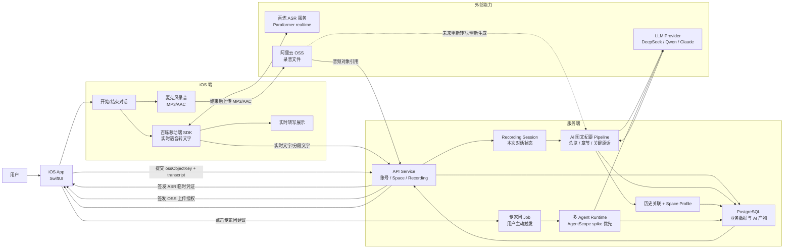

# V1 架构图：iOS + 服务端多 Agent

## 架构判断

这版架构只表达 V1 主流程：

```text
iOS 开麦实时对话
-> 百炼移动端 SDK 产出实时文字
-> iOS 保存 MP3/AAC 录音
-> MP3/AAC 上传 OSS
-> 服务端关联音频和文字
-> 服务端生成 AI 图文纪要
-> 用户主动触发专家团
-> 服务端多 Agent 生成建议
```

关键边界：

- iOS 是采集端和展示端。
- 服务端是数据和 AI 工作流中心。
- 数据都归服务端管理。
- OSS 只存音频对象，不承载业务语义。
- 专家团在服务端，不在 iOS。

## System Diagram



## Recording Flow

```text
1. 用户点击开始对话
2. iOS 请求服务端创建 Recording Session
3. 服务端返回 ASR 临时凭证和 OSS 上传授权
4. iOS 开始麦克风录音
5. 百炼移动端 SDK 实时产出文字
6. iOS 展示实时转写，并把文字片段提交给服务端
7. 用户点击结束
8. iOS 上传 MP3/AAC 到 OSS
9. iOS 通知服务端 ossObjectKey 和本次 transcript
10. 服务端生成 AI 图文纪要
11. 服务端保存纪要、章节、关键原话和历史关联
```

## Expert Advice Flow

```text
1. 用户在记录详情页点击专家团建议
2. 服务端冻结输入快照
3. Safety 预检
4. 三个专家多轮讨论
5. 裁判收敛
6. Safety 复检
7. 保存专家团过程和最终建议
8. iOS 展示结果
```

## Runtime Decision

V1 先做 AgentScope Expert Team spike：

```text
Leader + Worker + Team Message + Session Event Stream
```

保留 fallback：

```text
自研轻量状态机 / CrewAI Flow
```

Claude Code / Qoder CLI 暂不作为默认产品 runtime，只保留为开发期实验、代码实现和离线评测工具。

## Reusable Pattern

专家团不是一次性实现，而是本项目沉淀的一类通用服务端方案：

```text
docs/architecture/multi-agent-deliberation-service-pattern.md
```

后续 iOS、H5、Android、小程序都应复用同一套服务端 `job / event / artifact` 契约。客户端不直接理解 AgentScope 内部资源，AgentScope 只作为服务端 runtime adapter。
